# Cibersegurança Desafio Phishing

# (Phishing para captura de senhas do Facebook)


### Ferramentas

- Kali Linux
- setoolkit

### Configurando o Phishing no Kali Linux (Passo a passo)

01. Entre no terminal de comando do kali linux
- Terminal do kali linux em modo usuário padrão:
> 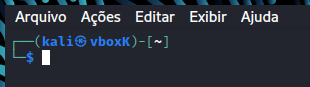
02. Mude do usuário padrão para o usuário root
- Acesso root - comando ->: ``` sudo su ```
> 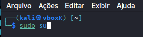
- Digite a senha:
> 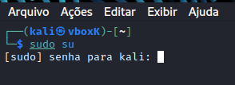
- Agora seu prompt indica o modo root:
> 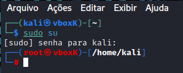
03. Execute a ferramenta setoolkit
- Iniciando o setoolkit - comando ->: ``` setoolkit ```
> 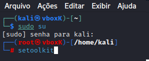
- setoolkit em execução:
> 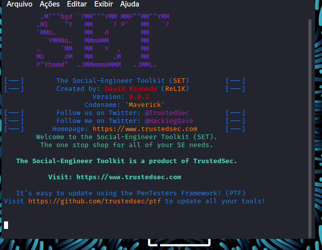
04. Selecione o tipo de ataque: ``` Social-Engineering Attacks ```
- Tipo de ataque - opção ->: ``` 1 ```
> 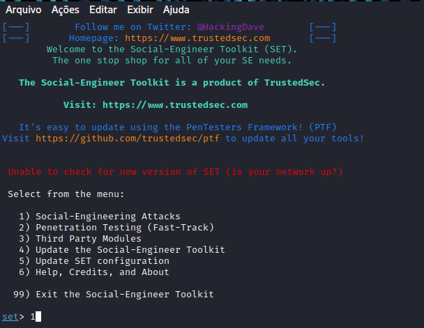
05. Selecione o Vetor de ataque: ``` Web Site Attack Vectors ```
- Vetor de ataque - opção ->: ``` 2 ```
> 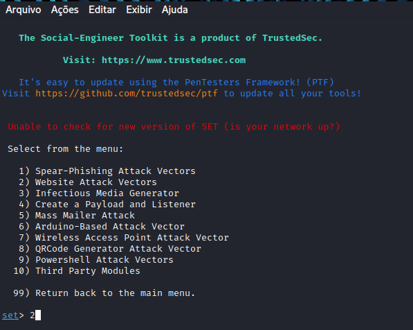
06. Método de ataque: ```Credential Harvester Attack Method ```
- Método de ataque - opção ->: ``` 3 ```
> 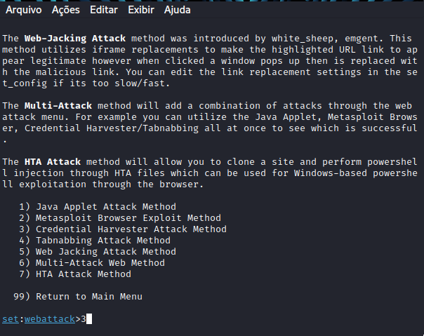
07. Método de ataque: ``` Site Cloner ```
- Método de ataque - opção ->: ``` 2 ```
> 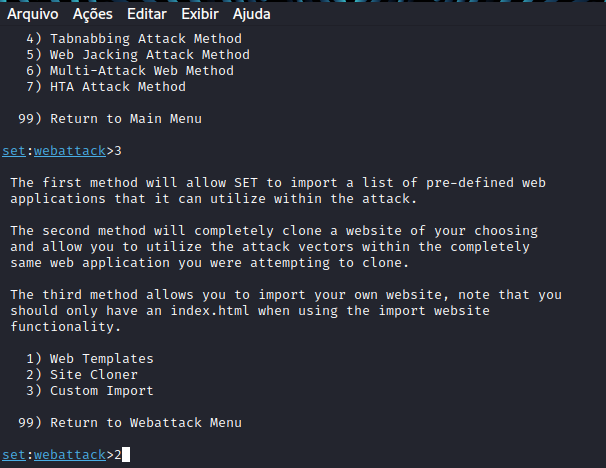
08. Obtendo o endereço da máquina kali linux
- Obtendo o endereço da máquina - comando ->: ``` ifconfig ```
> 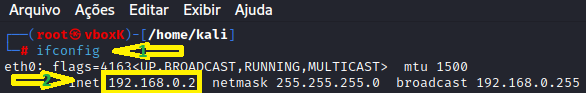
  - A seta nº 1 indica o comando digitado
  - A seta nº 2 indica o endereço IP da máquina kali linux
09. clone a URL do facebook
- URL para clone ->: http://www.facebook.com
> 

### Resutados
